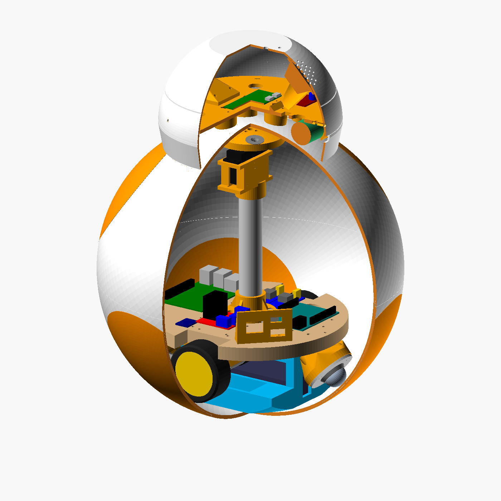

# CAD · piezas imprimibles del BB-8

Modelos paramétricos en OpenSCAD de todo lo que se imprime: la esfera en 14 gajos y 6
círculos, la base motriz, el poste con los imanes y la cabeza. Cambias un número en
`parametros.scad` y todo se recalcula (altura de las ruedas, de la plataforma, largo del
tubo, inclinación de los ball transfers…).



| Archivo | Qué tiene |
| --- | --- |
| `parametros.scad` | Todas las medidas. Las marcadas **MEDIR** vienen de hojas de vendedores que no coinciden: mide tu pieza antes de imprimir lo que depende de ellas |
| `componentes.scad` | Maquetas de lo comprado (JGB37, L298N, Uno, Pi 4, MG996R, Pi Zero, OV5647, anillo WS2812…). No se imprimen |
| `esfera.scad` | Casco: 14 gajos blancos, 6 círculos naranjas, tapa de carga, junta de bayoneta |
| `base.scad` | Plataforma (plantilla 1:1), soportes de motor, charola de LiPo con lastre, soportes de ball transfer, panel de carga |
| `poste.scad` | Pie del poste, soporte del servo, portaimanes |
| `cabeza.scad` | Casco de la cabeza, plato interior, soportes del ojo y de la bocina, tapones de las bolas |
| `ensamble.scad` | Todo junto, con corte y vista explotada |
| `exportar.sh` | Genera `stl/`, `plantillas/` y `png/` |

```bash
sudo apt install openscad xvfb      # o OpenSCAD desde openscad.org
bash cad/exportar.sh                # STL + plantilla + renders (~10 min, los gajos tardan)
bash cad/exportar.sh png            # solo los renders, segundos
openscad cad/ensamble.scad          # abrirlo y moverle
```

Los STL ya salen orientados para imprimir. Cuántas copias de cada uno, cómo imprimirlos,
la tornillería y las decisiones de diseño están en la wiki:
[Diseño 3D](../wiki/Diseno-3D.md).
