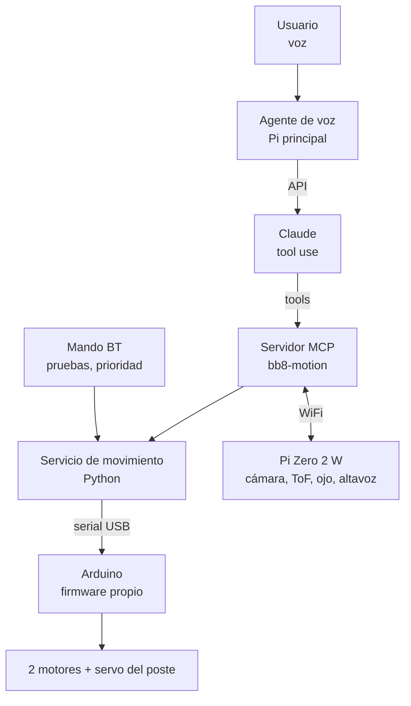
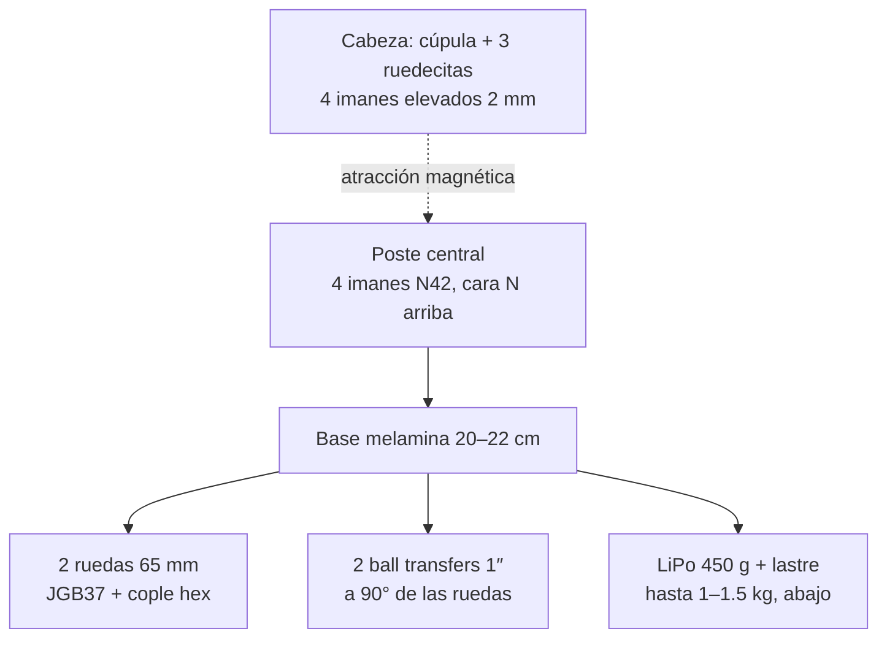
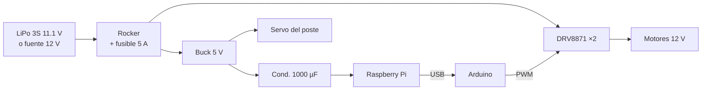
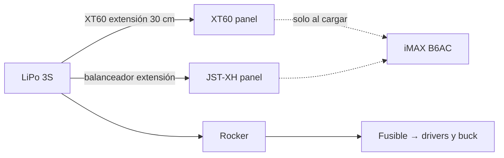
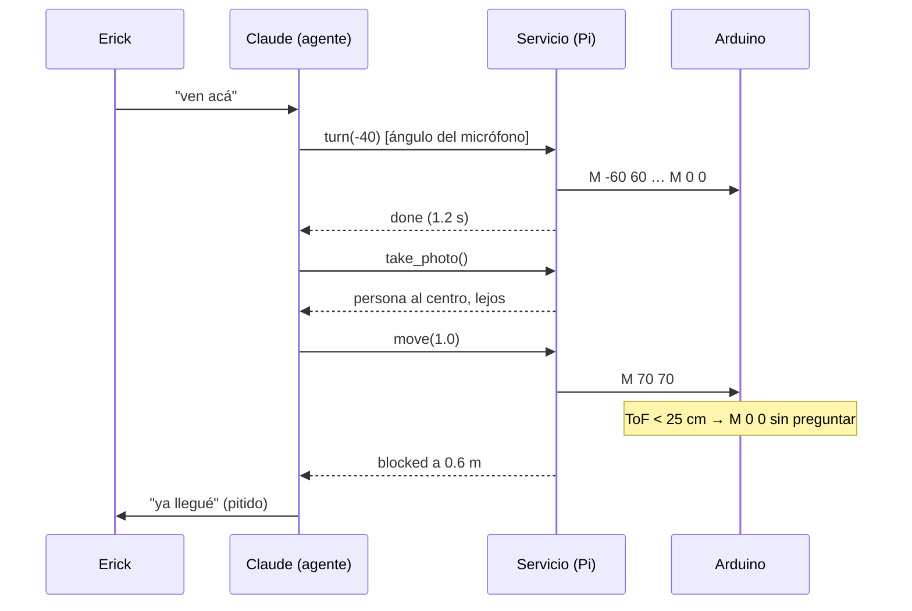
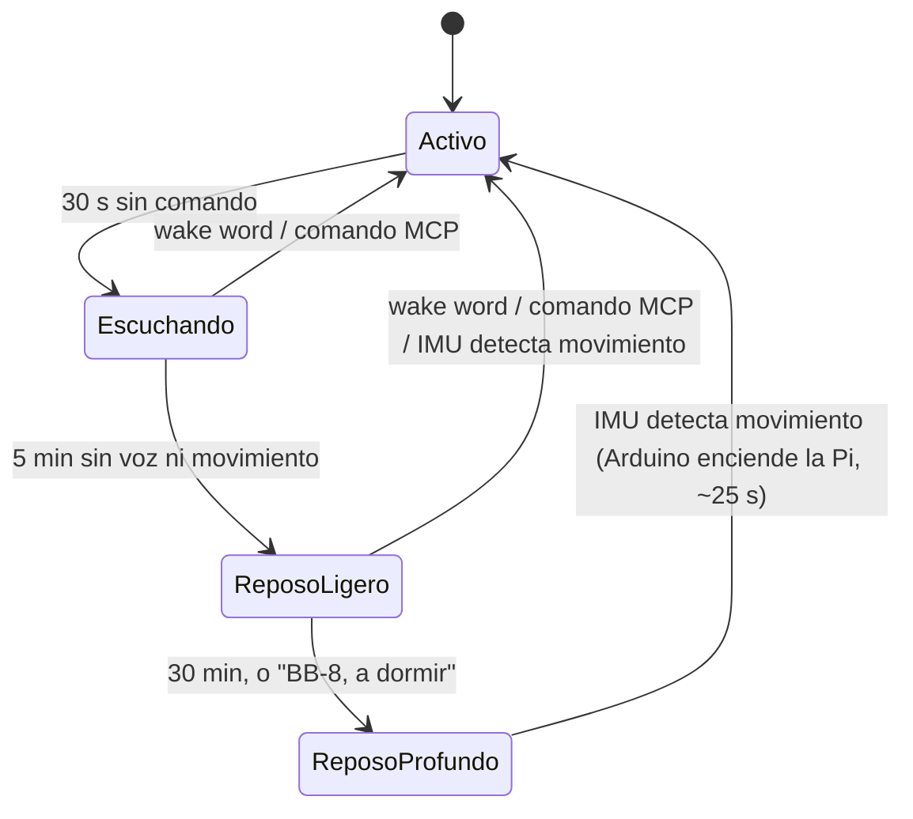

# Proyecto BB-8 con agente LLM

Sep 19, 2026 · @Erick

## 1. Arquitectura

Un BB-8 de 30–35 cm con el principio del Sphero: una base con dos ruedas rueda por dentro de la esfera y un poste con imanes sujeta la cabeza a través del casco. El movimiento lo escribe un servicio propio, sin ROS, y se expone al LLM como servidor MCP. El mando Bluetooth usa el mismo servicio para pruebas y tiene prioridad cuando lo tocas.



| Pieza | Rol |
| --- | --- |
| Raspberry Pi (normal) | Servicio de movimiento, servidor MCP, agente de voz |
| Arduino | Firmware de motores, encoders, servo, IMU; reflejos de seguridad |
| Raspberry Pi Zero 2 W | Cabeza: cámara, sensor ToF, NeoPixel, altavoz; batería propia |
| Mando Bluetooth | Control manual para pruebas, prioridad sobre el LLM |
| Claude | Decide qué hacer a partir de voz y fotos; nunca toca motores |

## 2. Plan por partes

Seis partes en orden de dependencia; cada una termina con algo tangible. Nada de esfera hasta que la base ruede sola y obedezca al agente. Las baterías entran hasta la Parte 6: antes, la Pi va con su cargador USB y los motores con una fuente de pared de 12 V.

### Parte 1 — Componentes conectados en protoboard

*Entregable:* los dos motores giran en ambos sentidos desde el Arduino, el servo barre 0–180° y la IMU imprime ángulos en el monitor serial.

- [ ] Ajustar el buck a 5.1 V en vacío antes de conectar nada
- [ ] Cablear en protoboard: fuente 12 V → DRV8871 ×2; Pi con su cargador USB; GND común entre fuente, Pi y Arduino
- [ ] Firmware mínimo: protocolo serial `M <izq> <der>` y `H <ángulo>`, respuesta `OK`/`ERR`
- [ ] Probar motores con PWM al 50 % y freno; probar servo; leer MPU6050 por I2C
- [ ] Foto del cableado y tabla de pines (va a la sección Electrónica)

### Parte 2 — Todo montado en la base de melamina

*Entregable:* un disco de melamina de 20–22 cm con motores, ruedas, ball transfers y electrónica fijos, con el hueco de la batería listo; se levanta con una mano y nada se mueve.

- [ ] Cortar el disco, marcar centro y ejes en + y ×
- [ ] Atornillar soportes de motor con las ruedas asomando por dos muescas opuestas
- [ ] Montar 2 ball transfers a 90° de las ruedas, a la misma altura de contacto
- [ ] Dejar el hueco de la LiPo (139 × 47 × 25 mm) centrado abajo; Arduino, drivers y buck arriba
- [ ] Poste central (tubo PVC 25 mm o varilla roscada) con el portaimanes arriba
- [ ] Pesar el conjunto y anotar el centro de gravedad

### Parte 3 — Test de movimiento con la base

*Entregable:* la base se maneja por comandos desde la Pi por USB y avanza, gira y frena en el piso sin la esfera; video de 30 s.

- [ ] Pi principal con Raspberry Pi OS Lite, conectada al Arduino por USB
- [ ] Servicio de movimiento en la Pi: envía `M`/`H`/`S`, lee la IMU, watchdog de 500 ms
- [ ] Mando Bluetooth con `evdev` para conducirla a mano
- [ ] Rutina de prueba: adelante 1 s, giro 90°, alto; medir deriva con la IMU
- [ ] Ajustar PWM máximo y rampa de aceleración para que no cabecee

### Parte 4 — Agente LLM controlando el movimiento

*Entregable:* le dices "BB-8, ven acá" o "da una vuelta" y la base lo hace; log de la conversación con las llamadas a herramientas.

- [ ] Servidor MCP `bb8-motion` con `move`, `turn`, `stop`, `get_pose` sobre el servicio de la Parte 3
- [ ] Probarlo primero desde Claude Desktop o Claude Code con el robot en el piso
- [ ] Micrófono y altavoz USB en la Pi; openWakeWord → faster-whisper `small` → Claude con tool use → Piper
- [ ] Personalidad en el system prompt; pitidos de droide entre respuestas
- [ ] Registro de voces (ver Voz e identificación)

### Parte 5 — Agente LLM controlando la cabeza

*Entregable:* la cabeza (todavía sin carcasa) gira hacia quien habla, la cámara manda una foto al modelo y BB-8 describe lo que ve; el ojo NeoPixel cambia de color según el estado.

- [ ] Chasis de cabeza: cámara OV5647, ToF VL53L1X, NeoPixel, power bank 18650, PAM8403 + altavoz
- [ ] Modificar el MG996R del poste a rotación continua si la cabeza va a girar 360°
- [ ] Herramientas MCP `look_at`, `take_photo`, `set_eye_color`, `say`
- [ ] Foto reducida a 640 px antes de enviarla al modelo
- [ ] Probar la unión magnética cabeza–poste sobre una superficie curva (una pelota de playa sirve)

### Parte 6 — Esfera impresa en 3D y baterías

*Entregable:* esfera de 30–35 cm en dos mitades que cierran sin cinta, con la base rodando adentro y la cabeza flotando encima; el BB-8 completo y sin cable.

- [ ] Modelar en Fusion 360: 6 círculos naranjas + 8 piezas blancas, cortadas para la cama de la impresora, con biscós de alineación
- [ ] Imprimir con 0.28 mm de capa y 10–15 % de relleno; \~2–3 kg de filamento
- [ ] Pegar, reforzar por dentro (fibra de vidrio o segunda capa de resina), lijar, primer, pintar, laca
- [ ] Cargar la LiPo con el B6AC en modo Balance; verificar 12.6 V y celdas parejas
- [ ] Pasar de la fuente de pared a LiPo → interruptor + fusible → drivers y buck; fijar la LiPo centrada abajo con velcro y brida
- [ ] Cortar el poste a la medida para que los imanes queden a 2–3 mm de la pared
- [ ] Lastre hasta 1–1.5 kg total, lo más abajo posible; probar que la base no vuelque al frenar
- [ ] Cabeza: cúpula impresa con 3 ruedecitas para que los imanes no rocen la pintura

## 3. Materiales

Qué tener en la mesa antes de empezar cada parte. ☑ = ya comprado. Precios aproximados en MXN a octubre de 2026; el total ronda los $5,600–7,700. Las partes 1 y 2 se pueden pedir juntas; la 5 y la 6 conviene esperar a que la 3 ruede, por si cambia el tamaño de la esfera.

| ✓ | Parte | Pieza | Cant. | Tienda | MXN |
| --- | --- | --- | --- | --- | --- |
| ☑ | 1 | Motorreductor JGB37-520B con encoder, 12 V, 319 RPM | 2 | UNIT | 231 c/u |
| ☑ | 1 | IMU MPU6050 | 1 | UNIT | 87 |
| ☑ | 1 | Servo MG996R | 2 | UNIT | 114 c/u |
| ☑ | 1 | Buck LM2596 ajustable 3 A | 1 | UNIT | 42 |
| ☑ | 1 | Condensador 1000 µF 16 V | 4 | UNIT | 3 c/u |
| ☑ | 1 | Kit protoboard + cables Dupont | 1 | UNIT | 200 |
| ☐ | 1 | Driver DRV8871 | 2–3 | Amazon | 119 c/u |
| ☐ | 1 | Fuente de pared 12 V 3 A con jack barril | 1 | Steren | 150 |
| ☐ | 1 | Adaptador jack barril a terminales de tornillo | 1 | Steren / UNIT | 30 |
| ☐ | 1 | Cable calibre 18 rojo/negro | 2 m | Steren | 60 |
| ☐ | 2 | Melamina 12–15 mm, 30 × 30 cm | 1 | Maderería | 80 |
| ☐ | 2 | Rueda de goma 65 mm + cople hexagonal eje D 6 mm | 2 | Mercado Libre | 75 c/u |
| ☐ | 2 | Soporte de motor JGB37 | 2 | Mercado Libre | 40 c/u |
| ☐ | 2 | Ball transfer 1″ | 2 | Mercado Libre | 60 c/u |
| ☐ | 2 | Tubo PVC 25 mm × 30 cm o varilla roscada 1/4″ + 4 tuercas | 1 | Ferretería | 40 |
| ☐ | 2 | Cinta doble cara 3M VHB | 1 | Mercado Libre | 100 |
| ☐ | 2 | Velcro adhesivo, bridas, tornillos M3 y pijas | 1 kit | Ferretería | 100 |
| ☐ | 2 | Termorretráctil surtido | 1 | Steren | 60 |
| ☐ | 3 | microSD 32 GB + cable USB a Arduino | 1 | Ya los tienes | 0 |
| ☐ | 3 | Mando Bluetooth (PS4/Xbox/genérico) | 1 | Ya lo tienes | 0 |
| ☐ | 4 | Micrófono USB (o ReSpeaker 2-Mic HAT, \~$450) | 1 | Steren / Amazon | 250 |
| ☐ | 4 | Bocina USB o DAC USB para la Pi principal | 1 | Steren | 150 |
| ☑ | 4 | Módulo Bluetooth HC-05 (opcional) | 1 | UNIT | 91 |
| ☐ | 5 | Raspberry Pi Zero 2 W + microSD | 1 | Ya la tienes | 0 |
| ☑ | 5 | Cámara OV5647 5 MP + cable de 15 pines para Zero | 1 | UNIT | 240 |
| ☑ | 5 | Anillo NeoPixel 16 LED WS2812, 45 mm | 1 | UNIT | 34 |
| ☐ | 5 | Sensor ToF VL53L1X | 1 | UNIT | 80 |
| ☐ | 5 | Power bank 18650 tipo tubo, 2,600 mAh | 1 | Mercado Libre | 250 |
| ☐ | 5 | Amplificador PAM8403 (o MAX98357 I2S) | 1 | Amazon / Geek Factory | 40–155 |
| ☐ | 5 | Altavoz 3 W 4 Ω | 1 | Geek Factory | 60 |
| ☐ | 5 | Cúpula 12–14 cm (impresa o media esfera de plástico) | 1 | Mercado Libre | 150 |
| ☐ | 5 | Imanes neodimio N42 20 × 5 mm | 8 | Mercado Libre | 150 |
| ☐ | 5 | 3 ruedecitas + eje 2.5 mm | 1 | Mercado Libre | 60 |
| ☐ | 6 | LiPo 3S 11.1 V 5200 mAh 80C, conector XT60 | 1 | Amazon / Geek Factory | 700–900 |
| ☐ | 6 | Cargador balanceador iMAX B6AC 80 W | 1 | UNIT / Amazon | 350–700 |
| ☐ | 6 | Alarma de voltaje LiPo 1S–8S | 1 | UNIT | 60 |
| ☐ | 6 | Conector XT60 macho con cable + XT60 hembra de panel | 1 | UNIT / Amazon | 80 |
| ☐ | 6 | Conector JST-XH 4 pines de panel + divisor en Y | 1 | Amazon | 60 |
| ☐ | 6 | Interruptor rocker 10 A | 1 | Steren | 40 |
| ☐ | 6 | Portafusible + fusibles 5 A | 1 | Steren | 50 |
| ☐ | 6 | Filamento PLA 1.75 mm | 2–3 kg | Mercado Libre | 600–900 |
| ☐ | 6 | Gorilla gel, resanador, primer, pintura blanca/naranja/plata, laca, lijas, cinta de pintor | 1 | Tlapalería | 300–500 |
| ☐ | 6 | Lastre (pesas o plomo) | 200–400 g | Mercado Libre | 50 |
| ☐ | 6 | Tuercas de nylon para imanes | 8 | Ferretería | 20 |
| ☐ | 6 | Módulo MOSFET IRF520 o relevador 5 V (opcional, reposo profundo) | 1 | UNIT | 40 |

### Dónde comprar

- **UNIT Electronics** (uelectronics.com): la electrónica en un solo pedido. Ya están ahí los motores, IMU, servos, buck, capacitores, cámara y NeoPixel.
- **Amazon MX**: lo que UNIT no tiene: DRV8871 (AMONIDA), LiPo Hilldow u Ovonic, PAM8403 en pack.
- **Geek Factory** (geekfactory.mx o Mercado Libre): alternativa para LiPo, cargador y audio.
- **Mercado Libre**: mecánica y misceláneos; filtrar por envío Full. Para la esfera, si no imprimes, buscar "esfera acrílica 30 cm en dos mitades" ($400–800) o pedirla en una acrilería local.
- **Steren**: tienda física para fuente, cables, interruptor, fusibles y lo que falte el mismo día.

### Notas de compra

- **DRV8871:** hasta 3.6 A y 45 V, sobra para el JGB37. Trae terminales de tornillo; el límite de corriente se fija con una resistencia en la placa. Comprar 3 por si uno sale malo. El DRV8833 de UNIT no sirve: máx. 10.8 V y 1.5 A por canal.
- **MG996R:** en UNIT elegir la opción "MG996R DIGI HI-TORQUE", no la MG995.
- **Buck LM2596:** comprar el módulo armado, no el chip. Ajustar la salida a 5.1 V y girar el preset de corriente al máximo antes de conectar la Pi; 2 A reales sin disipador.
- **Condensadores:** en UNIT es un listado con varios valores: elegir 1000 µF (12 × 8 mm). Pata larga a +5 V.
- **Cámara OV5647:** con 5 MP sobra, el agente manda fotos pequeñas. Verificar que incluya el cable de 15 pines para Zero (\~$40 aparte). Los LED IR se pueden desconectar si calientan.
- **NeoPixel:** la versión de 45 mm, no la de 68 mm (no cabe en la cabeza). 16 LED a blanco pleno piden \~1 A: alimentar del power bank y limitar brillo al 30 %. Datos por GPIO18 de la Pi Zero.
- **Ruedas:** la "Llanta de Goma 65 mm" de UNIT es para motor TT (eje 3 mm), no entra en el JGB37. Buscar "rueda 65 mm cople hexagonal 6 mm" o el kit JGB37 con rueda y soporte (Tecneu, Amazon). Forrar con cinta de silicona.
- **Ball transfer:** de bola metálica, 1″; resbala mejor sobre el casco que una rueda loca. No está en UNIT; sí en Mercado Libre y Sonrobots.
- **Melamina:** disco de Ø 20–22 cm con dos muescas para las ruedas; 3 mm de MDF era muy delgado.
- **LiPo 5200 mAh:** 2.5–3 h de uso activo; con 2200 mAh serían 1–1.5 h. Preferir XT60 (Hilldow, 450 g, 139 × 47 × 25 mm); si es Ovonic con Deans T, comprar adaptador Deans→XT60. Montada en el fondo hace de lastre.
- **Cargador:** buscar "cargador balanceador", no "LiPo". Elegir la versión AC (se enchufa a la pared). Cargar la 3S a 2.6 A (0.5C) en modo Balance.
- **Alarma de voltaje:** viene en 3.3 V/celda; subir a 3.5 V alarga la vida de la batería. Se enchufa al JST-XH y el buzzer se oye a través de la esfera.
- **PAM8403:** alimentar a 5 V del power bank, nunca a 11.1 V. Un canal en mono con el altavoz de 4 Ω. La Pi Zero no trae salida de audio: usar I2S (MAX98357) o un DAC USB barato.
- **Power bank 18650:** 97 × 26 mm, 63 g. Se apaga solo si la carga baja de \~100 mA; con el NeoPixel al 30 % no hay problema, si no, usar celda + TP4056 directo.
- **HC-05:** versión maestro/esclavo de 6 pines. Solo si la Pi y el Arduino van sin cable.
- **VL53L1X:** 4 cm–4 m para el freno reflejo; el VL53L0X (2 m) también sirve y es más barato.

## 4. Mecánica interna

Una plataforma con dos ruedas motrices sube por la pared interior de la esfera y la hace rodar; el lastre abajo la mantiene derecha y un poste con imanes arriba sujeta la cabeza a través del casco. Tomado del BB-8 de nachumtwersky en Instructables (2021), escalado a 30–35 cm.



| Elemento | Especificación | Por qué |
| --- | --- | --- |
| Base | Disco de melamina 12–15 mm, Ø 20–22 cm, dos muescas para las ruedas | Con 1.5 kg encima, 3 mm de MDF se pandea |
| Ruedas motrices | 2 × 65 mm goma, cople hexagonal eje D 6 mm, forradas con silicona | Contacto contra el casco; el cople es lo que casi nadie compra |
| Apoyo | 2 ball transfers 1″ a 90° de las ruedas, misma altura de contacto | Si tocan antes que las ruedas, la esfera no rueda |
| Lastre | LiPo 450 g + pesas hasta 1–1.5 kg, lo más abajo posible | Los imanes tiran hacia arriba; sin lastre se voltea |
| Poste | Tubo PVC 25 mm o varilla roscada 1/4″, portaimanes impreso arriba | Se recorta hasta dejar los imanes a 2–3 mm del casco |
| Imanes cuerpo | 4 × N42 20 × 5 mm avellanados, tuercas de nylon, cara N arriba | Los 8 de la lista alcanzan: 4 abajo, 4 arriba |
| Imanes cabeza | 4 iguales, cara S abajo, elevados sobre 3 ruedecitas | Si rozan el casco arruinan la pintura y frenan el giro |
| Giro de cabeza | MG996R a rotación continua en el poste; el portaimanes gira con él | La cabeza sigue al imán, no hace falta motor arriba |
| Interruptor | Rocker 10 A accesible desde una tapa del casco | Apagar sin abrir la esfera |

**Reglas que aprendió a golpes el Instructable**

- Probar que la base rueda dentro de la esfera **antes** de poner imanes y lastre; si las ruedas giran pero la esfera no, los ball transfers tocan primero.
- Los imanes N42 de 20 mm lastiman dedos y rompen piezas impresas; separarlos con una cuña de madera, nunca deslizando.
- Reforzar el casco impreso por dentro (resina o fibra) antes de pintar: pegado borde con borde no basta.
- El autor terminó añadiendo un IMU para PID contra el bamboleo al frenar; el MPU6050 y la rampa de la Parte 3 lo resuelven desde el inicio.

## 5. Electrónica y alimentación

Una sola batería para el cuerpo, con la Pi aislada de los picos de los motores; la cabeza lleva su propia batería porque va unida solo por imanes. Hasta la Parte 6 la LiPo se sustituye por la fuente de pared de 12 V y la Pi va con su cargador USB.



### Conexiones del Arduino

| Pin | Conecta a | Función |
| --- | --- | --- |
| D5, D6 | DRV8871 motor izquierdo (IN1, IN2) | PWM velocidad y sentido |
| D9, D10 | DRV8871 motor derecho (IN1, IN2) | PWM velocidad y sentido |
| D2, D3 | Encoders A/B | Interrupciones para contar pulsos |
| A4, A5 | MPU6050 (SDA, SCL) | I2C, inclinación; pin INT para despertar |
| D7 | Servo del poste | Giro de cabeza |
| D8 | Módulo MOSFET (opcional) | Corta la 5 V de la Pi en reposo profundo |
| USB | Raspberry Pi | Serial 115200 baudios |
| GND | Común a todo | Una sola masa |

### Reglas que evitan problemas

- Masa común: todos los GND unidos (fuente, Pi, Arduino, drivers), o el serial dará basura.
- La Pi nunca alimenta motores ni servos; solo el buck lo hace.
- Condensador de 1000 µF en la entrada 5 V de la Pi para que no se reinicie al arrancar los motores.
- Nunca descargar la LiPo por debajo de 3.3 V por celda (\~10 V); la alarma de voltaje se encarga.
- Fusible entre batería e interruptor: si algo se cruza dentro de la esfera no lo ves hasta que huele.
- Autonomía con 5200 mAh: 2.5–3 h de uso activo (ver Modo reposo).

### Cómo se carga sin abrir la esfera

Uno de los seis círculos naranjas del casco es una tapa desmontable (imanes o dos tornillos). Detrás, en un soporte impreso, quedan a la mano el rocker, un **XT60 hembra de panel** y un **JST-XH 4 pines de panel**, ambos con extensiones a la LiPo. Para cargar: apagar el rocker, abrir la tapa, enchufar el B6AC a los dos conectores y cargar en modo Balance a 2.6 A (\~2 h). La batería nunca sale del robot.



- El rocker debe estar apagado al cargar: el B6AC se confunde si el robot consume mientras carga.
- La alarma de voltaje va al mismo JST-XH de panel con un divisor en Y, para desconectarla cuando guardes el robot.
- Cabeza: el power bank 18650 se carga por micro-USB; una extensión de 15 cm llega a un puerto trasero de la cúpula, bajo la antena. \~3 h con cualquier cargador de teléfono.
- Descartado: cargador integrado con jack DC (no balancea celdas) y contactos pogo en el casco (una esfera no tiene "abajo" fijo).
- *Base de carga inductiva (opcional, después de la Parte 6):* la plataforma interna siempre cuelga hacia abajo, así que una bobina receptora bajo ella y una transmisora en una cuna se alinean solas a través del casco, como en el Sphero. Módulo inalámbrico 12 V / 15–30 W, cargador 3S CC/CV con balanceo ($150), diodo ideal, cuna impresa Ø 12 cm. A 15 W, 5–7 h para 5200 mAh. Que regrese sola a la cuna es otro proyecto.

## 6. Software: cómo se mueve

El LLM decide *qué* hacer; nunca maneja. Tres capas, cada una con su propio reloj, y la regla es que **ninguna capa lenta puede bloquear a una rápida**: el Arduino frena solo aunque la Pi esté esperando a Claude.

| Capa | Dónde | Ciclo | Qué hace | Qué no hace |
| --- | --- | --- | --- | --- |
| Reflejos | Arduino | 10 ms | Rampa, velocidad por encoders, freno si la IMU pasa de 35° o el ToF marca < 25 cm, watchdog de 500 ms | Decidir a dónde ir |
| Servicio de movimiento | Pi principal, Python | 50 ms | Traduce `move(1.0)` y `turn(90)` en `M`; cuenta encoders e integra el giroscopio; devuelve `done` o `blocked` | Interpretar lenguaje |
| Agente | Claude vía MCP | 1–4 s | Elige la siguiente herramienta según lo que ve y oye | Tocar motores |



| Evento | Quién reacciona | Tiempo | Por qué ahí |
| --- | --- | --- | --- |
| Pared a 25 cm, escalón, alguien lo empuja | Arduino (ToF + IMU) | < 20 ms | El LLM tarda segundos; para entonces ya chocó |
| Obstáculo que la cámara ve a 1 m | Servicio de movimiento | \~200 ms | Frena, devuelve `blocked`, Claude decide rodear o preguntar |
| Se pierde la conexión con la Pi | Arduino (watchdog) | 500 ms | Sin comandos nuevos = alto total |
| Orden nueva o cambio de plan | Claude | 1–4 s | Solo decide entre movimientos ya seguros |
| "Alto" por voz | Wake word + palabra clave | \~300 ms | openWakeWord con "BB-8 alto" como segunda wake word que manda `stop` directo |

Lo que hace tolerable esperar 1–4 s al agente: cada herramienta es **corta y auto-contenida**. `move(1.0)` avanza un metro y se detiene solo; no hay un motor girando mientras Claude piensa. Si el usuario habla a mitad de un movimiento, el servicio termina el paso actual (máximo 1.5 s) antes de atender la orden nueva; un "alto" cancela de inmediato.

Lo que no va a tener: mapa de la casa, memoria de dónde está el sillón, "ve a la cocina". Eso requiere SLAM, otro proyecto. Todo lo relativo a lo que ve y oye ahora mismo (ir hacia quien habla, seguir a alguien, rodear una silla, dar una vuelta) sí sale con lo de la lista.

### Firmware del Arduino

1. Parser de líneas serial: lee hasta `\n`, separa por espacios, primer token = comando.
2. `M <izq> <der>`: velocidad objetivo de cada rueda, −255…255.
3. Lazo PID cada 10 ms con los encoders para que ambas ruedas vayan a la velocidad pedida.
4. Rampa de aceleración (máx. 30 unidades por ciclo) para que la esfera no vuelque al arrancar.
5. Watchdog: sin comando en 500 ms → frena.
6. MPU6050: inclinación > 35° → frena y responde `ERR tilt`. ToF (vía la Zero) < 25 cm → frena y responde `ERR obstacle`.
7. `?` devuelve estado en una línea; `Z`/`W` duermen y despiertan (ver Modo reposo).

### Protocolo serial (Pi → Arduino, 115200 baudios)

```
M <izq> <der>    velocidad por rueda, -255..255
H <ángulo>       giro del poste (cabeza), grados
S                parar
?                estado → "OK V=11.6 T=3 E=142,139"
Z / W            dormir / despertar
```

El Arduino contesta `OK` o `ERR <motivo>` a cada línea. Al firmware no le importa quién origina la orden; la prioridad mando/LLM vive solo en el servicio.

### Servicio de movimiento (Pi, Python, \~200 líneas)

- Único dueño del puerto serial. API interna por socket Unix o HTTP local: `move(m)`, `turn(deg)`, `stop()`, `look_at(deg)`, `get_pose()`.
- Árbitro: si el mando ha enviado algo en el último segundo, las órdenes del LLM se rechazan con `manual_override`; al soltarlo, el LLM recupera el control.
- Cola serial única: una orden en curso a la vez; `stop` salta la cola.
- `move(1.0)` → pulsos de encoder objetivo (65 mm de rueda ≈ 4.9 vueltas/m, con factor de deslizamiento calibrado) → `M` hasta alcanzarlos; `turn` integra el giroscopio.
- Mando Bluetooth con `evdev`, mezcla arcade (`izq = y + x`, `der = y − x`), zona muerta ±10.
- Lee la cámara a 5 fps y marca "obstáculo al frente"; devuelve `blocked` con la distancia.
- Límites de seguridad en un solo sitio: velocidad máxima (PWM 50–60 % con los motores de 319 RPM), duración máxima de una orden (5 s), parada si el Arduino responde `ERR`.

### Servidor MCP `bb8-motion`

Escrito con el SDK de Python para MCP (`FastMCP`): cada herramienta es una función decorada que llama al servicio de movimiento o a la Zero. Transporte `streamable-http` en el puerto 8765 para conectarse desde otra máquina; `stdio` si solo lo usa el agente local. El agente de voz es un cliente más; también puedes conectarlo a Claude Desktop o Claude Code y conducir el robot desde el portátil. Las descripciones de las herramientas son la parte importante: le dicen a Claude que mire antes de avanzar en sitio nuevo y que no encadene más de tres movimientos sin preguntar.

| Herramienta | Parámetros | Qué hace |
| --- | --- | --- |
| `move` | metros (−2…2) | Avanza con encoders; devuelve metros reales o `blocked` |
| `turn` | grados (+ derecha, − izquierda) | Giro sobre sí mismo con giroscopio |
| `stop` | — | Frena, salta la cola |
| `look_at` | grados | Gira el poste; la cabeza sigue al imán |
| `take_photo` | — | Foto de la Zero a 640 px, devuelta como imagen |
| `set_eye_color` | color, patrón | Anillo NeoPixel |
| `say` | texto o sonido (feliz, triste, alerta, pregunta) | Piper o WAV en el altavoz de la cabeza |
| `get_pose` | — | Batería, inclinación, distancia ToF, quién controla |

### Personalidad (system prompt)

- Habla poco y con pitidos entre palabras; curioso, leal, algo cabezota.
- Antes de moverse en un sitio nuevo usa `take_photo` para no chocar; nunca más de 1 m sin volver a mirar.
- Si el mando está activo, no insiste: "el piloto manda".
- Si `get_pose` marca inclinación alta o batería baja, lo avisa y se para.
- Saluda por nombre a las voces registradas y no obedece órdenes de movimiento de desconocidos.
- Responde en español; frases de menos de 15 palabras porque irán a TTS.

### Voz e identificación

| Problema | Cómo | Dónde corre | Costo |
| --- | --- | --- | --- |
| Detectar que le hablan | openWakeWord ("oye BB-8", \~10 % CPU) → Silero VAD graba hasta 0.8 s de silencio → faster-whisper `small` transcribe (2–4 s) | Pi principal, sin internet | 0 |
| Saber quién habla | Embedding de voz (Resemblyzer o ECAPA): 3 s de audio → vector de 256; similitud > 0.75 contra las voces registradas → "Habla Erick" en el system prompt | Pi principal, en paralelo (\~0.3 s) | 0 |
| Saber de dónde viene la voz | ReSpeaker 2-Mic HAT: da el ángulo y cancela el eco del propio altavoz. Plan B: la cabeza barre hasta que la cámara ve una cara | HAT sobre la Pi principal | \~$450 |

- Registro de voces: cada persona dice 3–4 frases una vez; se guarda el promedio de embeddings en `voices.json`. No es biometría segura, pero basta para saludar por nombre y guardar preferencias.
- El ReSpeaker sustituye al micrófono USB: sin cancelación de eco, BB-8 se oye a sí mismo y dispara su propia wake word.
- Toda la voz se procesa en la Pi; solo el texto transcrito y las fotos van a Claude.

### Stack en la Pi

| Función | Herramienta | Por qué |
| --- | --- | --- |
| Wake word | openWakeWord | Local, ligero |
| STT | faster-whisper `small` | Buen español, corre en Pi 4/5 |
| LLM | Claude API con tool use | Decide acciones de forma fiable |
| TTS | Piper (voz es\_ES) | Local y rápido |
| Serial | pyserial | Estándar |
| MCP | FastMCP | Mismas herramientas para voz, Desktop y Code |
| Cabeza | Flask en la Zero | `/foto`, `/hablar`, `/tof`, `/ojo` |

### Modo reposo de bajo consumo

Dos niveles: *reposo ligero*, donde la Pi sigue escuchando la wake word y el resto se apaga por software; y *reposo profundo*, donde la Pi se apaga del todo y el Arduino queda dormido vigilando la IMU. Con la LiPo de 5200 mAh:

| Estado | Qué está encendido | Consumo | Autonomía |
| --- | --- | --- | --- |
| Activo | Todo, motores en movimiento | 1.5–2 A | 2.5–3 h |
| Escuchando | Pi + micrófono, motores frenados, ojo al 30 % | \~0.6 A | \~8 h |
| Reposo ligero | Pi con WiFi; cámara y ojo apagados, servo sin PWM, drivers en sleep | \~0.25 A | \~20 h |
| Reposo profundo | Solo Arduino dormido + IMU + alarma de voltaje | \~15 mA | Días |



*Reposo ligero* no necesita hardware extra:

- Drivers: el DRV8871 entra solo en sleep (<10 µA) con IN1 = IN2 = 0 por más de 1 ms; basta `M 0 0`.
- Servo: `servo.detach()` quita el PWM y baja de \~100 mA a \~5 mA; al despertar, `attach()` y mover despacio a la última posición.
- Ojo: NeoPixel en negro (\~16 mA); una respiración azul al 3 % cuesta menos de 30 mA si quieres que se note que duerme.
- Cámara: cerrar el proceso de captura; en idle consume \~150 mA.
- Pi Zero 2 W: `cpufreq` en `powersave`, Bluetooth apagado, HDMI desactivado (`tvservice -o`) bajan \~60 mA. No apagar el WiFi: es la vía para despertarla por MCP.
- Comandos `Z` (dormir) y `W` (despertar) que el firmware traduce en lo anterior.

*Reposo profundo* necesita el **módulo MOSFET o relevador de 5 V** entre el buck y la Pi, controlado por D8 del Arduino:

- La Pi hace `shutdown -h` limpio y avisa al Arduino; 10 s después el Arduino corta su alimentación (una Pi apagada pero conectada sigue consumiendo \~50 mA).
- El Arduino entra en `SLEEP_MODE_PWR_DOWN` (\~10 mA en Nano/Uno; <1 mA en Pro Mini sin LED) y despierta por la interrupción de movimiento del MPU6050.
- Al despertar cierra el MOSFET, la Pi arranca en \~25 s y BB-8 pita "me desperté". Si el retraso molesta, quedarse en reposo ligero.
- La alarma de voltaje sigue conectada al balanceador y suena aunque todo duerma.
