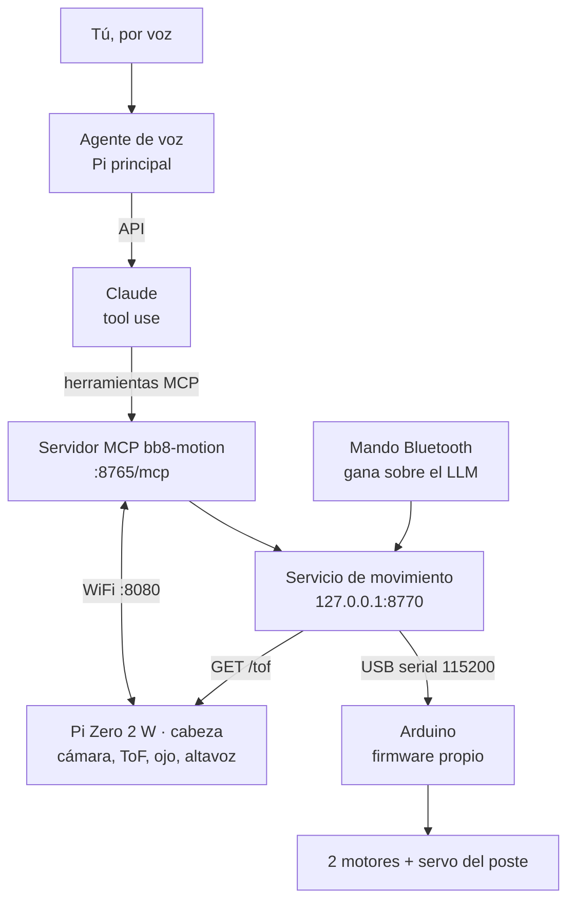

# Arquitectura

BB-8 funciona como un Sphero: una base con dos ruedas rueda por dentro de la esfera
y la hace girar; el lastre abajo la mantiene derecha, y un poste con imanes sujeta la
cabeza a través del casco. El software no usa ROS: son tres capas, cada una más lenta
y más lista que la de abajo.

## Las tres capas

| Capa | Dónde | Ciclo | Hace |
| --- | --- | --- | --- |
| Reflejos | Arduino ([firmware](https://github.com/erickdsama/bb8/tree/main/partes/1-protoboard/arduino/bb8_firmware)) | 10 ms | Rampa, PID con encoders; frena si se inclina > 35°, si hay un obstáculo a < 25 cm o si pasan 500 ms sin órdenes |
| Servicio de movimiento | Pi, Python ([`bb8`](https://github.com/erickdsama/bb8/tree/main/partes/3-base-andando/bb8)) | 50 ms | Único dueño del serial. Convierte metros y grados en pulsos de encoder, arbitra entre mando y LLM, impone límites |
| Agente | Claude vía MCP ([`bb8_mcp`](https://github.com/erickdsama/bb8/tree/main/partes/4-agente-movimiento/bb8_mcp)) | 1–4 s | Decide qué herramienta sigue según lo que ve y oye |

Cada herramienta es corta y termina sola (máx. 2 m, 5 s, PWM 55 %), así que mientras
Claude piensa no hay un motor girando. Los límites viven en el servicio y en el
firmware, no en el prompt.

## Qué corre en cada placa

| Placa | Procesos | Código |
| --- | --- | --- |
| Raspberry Pi principal | `bb8.motion_api` (:8770), `bb8_mcp` (:8765), `voz`, `energia` (:8771) | partes 3, 4 y 6 |
| Raspberry Pi Zero 2 W (cabeza) | `head.server` (:8080): cámara OV5647, ToF, anillo WS2812, altavoz | parte 5 |
| Arduino Uno | `bb8_firmware`: L298N, encoders, servo MG996R, MPU6050, VL53L0X | parte 1 |
| Tu PC | El simulador reemplaza al Arduino y a la Zero; el resto es el mismo código | `simulador/` |

## Herramientas que ve Claude

| Herramienta | Qué hace |
| --- | --- |
| `move(metros)` | Avanza o retrocede hasta 2 m; devuelve `done`, `blocked` (obstáculo), `manual_override`, `cancelled` o `error` |
| `turn(grados)` | Gira sobre su eje con el giroscopio; + es derecha |
| `stop()` | Cancela cualquier movimiento |
| `look_at(grados)` | Gira la cabeza −90…90° con el servo del poste |
| `take_photo()` | Foto de la cabeza, 640 px |
| `set_eye_color(color, patron)` | Anillo NeoPixel |
| `say(texto o sonido)` | Habla con Piper o pita |
| `get_pose()` | Posición, rumbo, inclinación, batería, distancia al frente |

## Seguridad

- El mando Bluetooth gana si se tocó en el último segundo.
- Voces no registradas pueden platicar, pero `move`, `turn` y `look_at` se bloquean en el código.
- El Arduino frena solo; Claude se entera después por el resultado `blocked`.
- El MCP escucha en 127.0.0.1 por defecto. Con `--host 0.0.0.0` no tiene contraseña: solo en la WiFi de casa.

Los mensajes exactos de cada enlace están en [Protocolo](Protocolo.md). Los diagramas
de cableado, alimentación y secuencia están en el artefacto
[Diagramas](Artefactos.md#diagramas).
