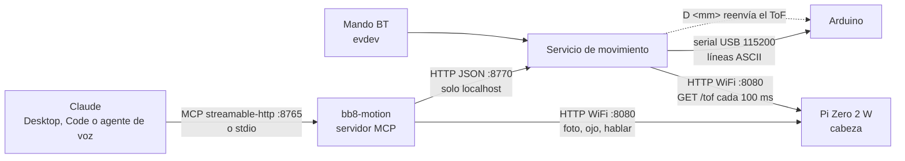

# Protocolo de comunicación del BB-8

Versión 0.2 · 2026-10-09 (añade `P`, banderas `bateria` e `imu`, `ERR bateria`). Fuente única de verdad para el firmware del Arduino, el
código de la Pi, la cabeza (Pi Zero 2 W) y el robot dummy. Si algo cambia aquí,
cambia en [`partes/3-base-andando/bb8/protocol.py`](https://github.com/erickdsama/bb8/blob/main/partes/3-base-andando/bb8/protocol.py),
en [`simulador/dummy/arduino_sim.py`](https://github.com/erickdsama/bb8/blob/main/simulador/dummy/arduino_sim.py)
y en el firmware [`partes/1-protoboard/arduino/bb8_firmware`](https://github.com/erickdsama/bb8/tree/main/partes/1-protoboard/arduino/bb8_firmware).

## Quién habla con quién



| Enlace | Transporte | Dirección | Quién inicia |
| --- | --- | --- | --- |
| Claude → MCP | MCP streamable-http (`/mcp`, puerto 8765) o stdio | petición/respuesta | Claude |
| MCP → servicio de movimiento | HTTP JSON, `127.0.0.1:8770` | petición/respuesta | MCP, agente de voz |
| Servicio → Arduino | Serial USB 115200 8N1, una línea por orden | petición/respuesta, una a la vez | Siempre la Pi |
| MCP → cabeza | HTTP JSON, `bb8-head.local:8080` | petición/respuesta | MCP |
| Servicio → cabeza | HTTP `GET /tof` cada 100 ms | sondeo | Servicio |

Reglas que no se rompen:

- El servicio de movimiento es el **único** proceso que abre el puerto serial.
- El Arduino nunca habla sin que le pregunten: toda línea suya es la respuesta a una línea de la Pi.
- El MCP no habla con el Arduino; todo movimiento pasa por el servicio (árbitro mando/LLM).
- En el dummy, el puerto serial es `socket://127.0.0.1:5555` (pyserial lo abre igual que `/dev/ttyACM0`) y la cabeza es `http://127.0.0.1:8080`.

## 1. Serial Pi → Arduino

115200 baudios, 8N1, ASCII. Cada orden es una línea terminada en `\n` (se acepta
`\r\n`), máximo 63 caracteres, tokens separados por un espacio. El Arduino
responde **exactamente una línea** por orden: `OK [datos]` o `ERR <motivo>`.
La Pi espera la respuesta (timeout 200 ms) antes de mandar la siguiente.

| Orden | Argumentos | Respuesta OK | Qué hace |
| --- | --- | --- | --- |
| `M <izq> <der>` | enteros −255…255 | `OK` | Velocidad objetivo de cada rueda en escala PWM. El PID por encoders y la rampa (máx. 30 por ciclo de 10 ms) la persiguen. Alimenta el watchdog. |
| `S` | — | `OK` | Alto inmediato con freno, sin rampa. Siempre se acepta, aun dormido. |
| `H <grados>` | entero −90…90 | `OK` | Ángulo del poste (cabeza). 0 = al frente, + derecha. Con MG996R posicional: servo = 90 + grados. |
| `D <mm>` | entero 0…4000 | `OK` | Última distancia del ToF de la cabeza, reenviada por la Pi. 0 = sin lectura. Válida 300 ms. |
| `?` | — | `OK V=… T=… Y=… E=…,… H=… D=… F=…` | Estado (ver abajo). |
| `Z` | — | `OK` | Dormir: freno, motores sin PWM, servo `detach()`, rechaza `M` y `H`. |
| `W` | — | `OK` | Despertar: `attach()` del servo y vuelve a la última posición despacio. |
| `I` | — | `OK BB8 fw=<versión>` | Identificación. El dummy responde `fw=sim-0.1`. |
| `P <s>` | entero 0, 5…120 | `OK` | Reposo profundo (Parte 6): frena y, pasados `s` segundos, corta la alimentación de la Pi (A3), duerme y despierta cuando la IMU detecta movimiento; entonces reconecta la Pi. La Pi lo manda justo antes de `shutdown -h`. `P 0` cancela una cuenta pendiente. |

### Línea de estado `?`

```
OK V=11.62 T=3.1 Y=-12.4 E=1420,1398 H=0 D=1830 F=-
```

| Clave | Unidad | Significado |
| --- | --- | --- |
| `V` | voltios | Batería. `0.00` = no se mide (sin divisor en A0, fuente de pared hasta la Parte 6) |
| `T` | grados | Inclinación absoluta (máx. de pitch y roll) del MPU6050 |
| `Y` | grados | Rumbo integrado del giroscopio, + derecha, sin envolver (puede pasar de 360) |
| `E` | pulsos | Encoders izquierdo,derecho acumulados con signo desde el arranque |
| `H` | grados | Ángulo actual del poste |
| `D` | mm | Última distancia ToF recibida con `D` (0 si caducó) |
| `F` | lista | Banderas activas separadas por coma, o `-`: `obstacle`, `tilt`, `watchdog`, `sleep`, `bateria` (menos de 10.5 V durante 5 s), `imu` (el MPU6050 no responde: sin freno por inclinación ni rumbo) |

La Pi debe ignorar claves que no conozca, para poder añadir campos sin romper nada.

### Errores

| Respuesta | Cuándo |
| --- | --- |
| `ERR syntax` | Orden desconocida, argumentos que faltan o no son enteros |
| `ERR range` | Argumento fuera de rango |
| `ERR obstacle` | `M` con avance neto (`izq + der > 0`) mientras `D` < 250 mm. Retroceder y girar en el sitio sí se aceptan |
| `ERR tilt` | `M` mientras la inclinación supera 35°. Se libera sola por debajo de 25° |
| `ERR sleep` | `M` o `H` estando dormido |
| `ERR bateria` | `M` con la batería por debajo de 9.9 V (3.3 V por celda). Solo con el divisor en A0 |

### Reflejos del firmware (no esperan a la Pi)

| Evento | Reacción | Bandera |
| --- | --- | --- |
| Inclinación > 35° | Freno inmediato, objetivo a 0 | `tilt` |
| `D` válido < 250 mm y avanzando | Freno inmediato, objetivo a 0 | `obstacle` |
| Ruedas con objetivo ≠ 0 y 500 ms sin un `M` | Freno, objetivo a 0 | `watchdog` (se borra con el siguiente `M`) |

Solo `M` alimenta el watchdog: si el lazo de movimiento de la Pi se cuelga, el `?`
del sondeo no mantiene vivos los motores. Por eso el servicio reenvía `M` cada
100 ms mientras hay movimiento.

### Arranque

Abrir el puerto reinicia el Uno/Nano (~2 s). La Pi espera 2 s, vacía la entrada,
manda `I` y comprueba que la respuesta empiece por `OK BB8`.

### Ejemplo de sesión

```
Pi  → I            Ard → OK BB8 fw=0.1
Pi  → H 0          Ard → OK
Pi  → D 1830       Ard → OK
Pi  → M 70 70      Ard → OK
Pi  → ?            Ard → OK V=12.00 T=1.2 Y=0.3 E=310,305 H=0 D=1610 F=-
Pi  → D 240        Ard → OK          (el Arduino frena solo aquí)
Pi  → M 70 70      Ard → ERR obstacle
Pi  → M -60 -60    Ard → OK          (retroceder sí se permite)
Pi  → S            Ard → OK
```

### Nota sobre el ToF

El ToF vive en la cabeza, pero el freno reflejo vive en el Arduino. El servicio de
movimiento lee `GET /tof` de la Zero cada 100 ms y lo reenvía como `D <mm>`.
Solo lo reenvía si la cabeza mira al frente (`|H| ≤ 15°`); si mira a un lado manda
`D 0`, porque esa distancia no es la del camino. Si la WiFi se cae, `D` caduca a
los 300 ms y el freno por ToF deja de actuar; el watchdog y la IMU siguen.

### Cambio por el L298N

El documento técnico asumía DRV8871 (2 pines PWM por motor). Con el L298N cada
motor usa 1 PWM (`EN`) + 2 de dirección (`IN`). El protocolo no cambia; solo el
firmware. Pinout acordado con el hilo de diagramas (Uno/Nano, un L298N para los
dos motores, jumpers ENA/ENB quitados):

| Pin | Función |
| --- | --- |
| D5 / D6 | ENA / ENB (PWM, Timer0), motor izq / der |
| D7, D8 | IN1, IN2 (motor izquierdo) |
| D11, D12 | IN3, IN4 (motor derecho) |
| D2 / D3 | Encoder C1 izq / der (INT0 / INT1) |
| D4 / D10 | Encoder C2 izq / der |
| D9 | Servo del poste (la librería Servo inutiliza el PWM de D9 y D10) |
| A4 / A5 | I2C: MPU6050 (0x68) y, en las Partes 1–4, VL53L0X (0x29) |
| A2 | INT del MPU6050 (pin-change, para despertar) |
| A3 | Corte de la Pi para el reposo profundo (Parte 6). En alto = Pi apagada, así un reset del Arduino la deja encendida |
| A0 | Divisor de voltaje de batería (campo `V` de `?`) |

**ToF local en las Partes 1–4.** Mientras el ToF esté en el bus I2C del Arduino,
el firmware usa esa lectura para el freno y `D` es opcional (si llegan las dos,
gana la local). Cuando el sensor pase a la cabeza, la Pi empieza a mandar `D`.

El L298N tira ~2 V, así que a 12 V el motor ve ~10 V: velocidad máxima ~0.9 m/s
en vez de 1.08 m/s. No tiene modo sleep; en `Z` el firmware pone `EN` a 0.

## 2. HTTP del servicio de movimiento (Pi, `127.0.0.1:8770`)

JSON en ambos sentidos. Solo escucha en localhost: lo usan el MCP y el agente de voz.

| Método y ruta | Cuerpo | Respuesta |
| --- | --- | --- |
| `POST /move` | `{"metros": 1.0}` (−2…2) | resultado de movimiento |
| `POST /turn` | `{"grados": 90}` (−360…360, + derecha) | resultado de movimiento |
| `POST /look_at` | `{"grados": 30}` (−90…90) | `{"resultado":"done","grados":30}` |
| `POST /stop` | — | `{"resultado":"done"}`. Cancela lo que esté en curso |
| `GET /pose` | — | pose (abajo) |
| `POST /manual` | `{"izq": 120, "der": 120}` | Lo usa el mando. Reenviar cada ≤ 200 ms o el watchdog para |
| `POST /sleep`, `POST /wake` | — | `{"resultado":"done"}` |
| `POST /apagar` | `{"segundos": 15}` (5…120) | `{"resultado":"done","corte_en_s":15}`. Manda `P`; quien llama hace `shutdown -h` enseguida |

Resultado de movimiento:

```json
{"resultado": "done", "metros": 0.98, "segundos": 2.1}
{"resultado": "blocked", "metros": 0.42, "distancia_m": 0.24, "motivo": "obstacle"}
{"resultado": "manual_override"}
{"resultado": "cancelled", "metros": 0.3}
{"resultado": "timeout", "metros": 1.7}
{"resultado": "error", "motivo": "tilt"}
```

`resultado` es uno de `done`, `blocked`, `manual_override`, `cancelled`, `timeout`,
`error`. Las órdenes de movimiento van en cola: una a la vez; `stop` se salta la cola.
El mando tiene prioridad: si mandó algo en el último segundo, `move`, `turn` y
`look_at` devuelven `manual_override` sin moverse.

Pose:

```json
{"x_m": 0.52, "y_m": -0.10, "rumbo_deg": 12.4, "inclinacion_deg": 1.2,
 "bateria_v": 11.62, "cabeza_deg": 0, "tof_m": 1.83, "banderas": [],
 "control": "llm", "dormido": false, "arduino": "OK BB8 fw=0.1"}
```

`control` es `llm`, `manual` (mando activo en el último segundo) o `idle`.

## 3. HTTP de la cabeza (Pi Zero 2 W, puerto 8080)

| Método y ruta | Cuerpo / parámetros | Respuesta |
| --- | --- | --- |
| `GET /estado` | — | `{"ok":true,"camara":"picamera2"\|"webcam"\|"sintetica","tof":"vl53l0x"\|"vl53l1x"\|"ninguno"\|"sim"}` |
| `GET /foto` | `?ancho=640` | `image/jpeg`, lado mayor = `ancho` |
| `GET /tof` | — | `{"mm": 1830, "t": 1760000000.12}`; `mm = 0` sin lectura |
| `POST /ojo` | `{"color":"#3080ff" o "azul","patron":"fijo"\|"respirar"\|"parpadeo"\|"apagado","brillo":0.3}` | `{"ok":true}` |
| `POST /hablar` | `{"texto":"hola"}` o `{"sonido":"feliz"\|"triste"\|"alerta"\|"pregunta"}` | `{"ok":true,"segundos":1.2}` al terminar |
| `GET /cara` | — | `{"ok":true,"caras":[{"x":0.21,"y":-0.1,"area":0.034}]}`, de mayor a menor; `x` −1…1 de izquierda a derecha de la foto. 501 sin OpenCV |
| `POST /reposo` | `{"activo": false}` | Reposo ligero: cámara pausada y ojo con respiración azul al 3 %. `{"activo": true}` lo revierte |

Colores con nombre aceptados: `rojo, verde, azul, blanco, naranja, amarillo,
morado, cian, apagado`. El brillo se limita a 0.3 (el anillo pide ~1 A a blanco pleno).

Solo en el dummy:

| Ruta | Para qué |
| --- | --- |
| `POST /sim/empujar` | `{"grados": 40}` simula que alguien lo inclina durante 1 s |
| `GET /sim/mundo` | Posición real del robot en la habitación simulada |
